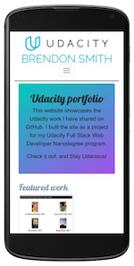
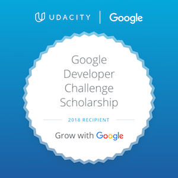

# About me

Brendon Smith

br3ndonland

## TOC
<!-- START doctoc generated TOC please keep comment here to allow auto update -->
<!-- DON'T EDIT THIS SECTION, INSTEAD RE-RUN doctoc TO UPDATE -->
**Table of Contents**  *generated with [DocToc](https://github.com/thlorenz/doctoc)*

- [Intro](#intro)
- [My journey](#my-journey)
- [Custom computing curriculum](#custom-computing-curriculum)
- [Udacity Full Stack Web Developer Nanodegree program](#udacity-full-stack-web-developer-nanodegree-program)
- [Udacity Grow with Google program](#udacity-grow-with-google-program)

<!-- END doctoc generated TOC please keep comment here to allow auto update -->


## Intro

I am a molecular nutrition scientist building skills in web development to create a more efficient, reproducible, and sustainable research culture. This website showcases the Udacity work I have shared on GitHub. I am currently working on the [Full Stack Web Developer Nanodegree program](https://www.udacity.com/course/full-stack-web-developer-nanodegree--nd004).


## My journey

I got into web development while doing research in a molecular nutrition and metabolism lab. I have confidence in the power of science to teach us about the world, but I began to see that **the way we do scientific research now is not effective.** It's resulted in what we call the **reproducibility crisis.** The research published by one lab can't be repeated by other labs, so it's not real progress, and doesn't translate into treatments or cures for humans.

**Science needs to improve in three ways:**

1. **Efficiency**
2. **Reproducibility**
3. **Sustainability**

We need better technology tools, like robotic automation and research management software, to make our work more efficient. We need to document our work so others can reproduce it. And we need to enable scientists to lead more balanced, rewarding lifestyles.

**When I realized this, I decided to dedicate myself to creating technologies that can improve science.**

I had some statistics and data science training, but no development experience. I thought about different ways to learn, like code bootcamps or computer science grad school. I decided to put together my own custom computing curriculum, including the Udacity Full Stack Web Developer Nanodegree program. I've been working on it for the past few months, and have really enjoyed it. **Web development, like scientific research, engages the two major motivating outcomes in my life, focused personal growth and positive impact.**


## Custom computing curriculum
[(Back to TOC)](#toc)

I have been learning about computers with these resources.

* **Foundational**
	- [Harvard cs50](https://cs50.harvard.edu)
	- [How Computers Work, by Ron White](https://www.amazon.com/How-Computers-Work-Evolution-Technology/dp/078974984X)
	- [basecs](https://medium.com/basecs)
	- [CodeNewbie](https://www.codenewbie.org/)
* **Practical**
	- [Udacity Full Stack Web Developer Nanodegree program](https://www.udacity.com/course/full-stack-web-developer-nanodegree--nd004)
	- [Udacity Grow with Google scholarship](https://www.udacity.com/grow-with-google)
* **Historical**
	- [The Innovators, by Walter Isaacson](http://a.co/66iyBT1)
	- [Steve Jobs, by Walter Isaacson](http://a.co/4aPdCcS)
	- [Where Good Ideas Come From: The Natural History of Innovation, by Steven Johnson](http://a.co/fwkJ8uz)
	- [What Technology Wants, by Kevin Kelly](http://a.co/1zgpMlU)
* **Cultural**
	- [Halt and Catch Fire](http://www.imdb.com/title/tt2543312/)
	- [Silicon Valley](http://www.imdb.com/title/tt2575988/)
	- [Mr. Robot](http://www.imdb.com/title/tt4158110/)


## Udacity Full Stack Web Developer Nanodegree program
[(Back to TOC)](#toc)

Here are some highlights from my work in the program:


### Break timer
[Code on GitHub](https://github.com/br3ndonland/udacity-fsnd/blob/master/01-foundations/python/fsnd01_05_functions.ipynb)

**This was my first milestone as a computer programmer.** 

When I began learning Python syntax in the Full Stack Web Developer Nanodegree program, progress was slow, and it was difficult to express myself. It felt very much like the mental exhaustion of practicing a spoken language. The Udacity introductory materials actually recommended that I start with a beginner Nanodegree program first, but I knew that with my motivation and education, I could fill in the gaps in my knowledge and competency. I kept at it and didn't let myself get discouraged.

I got to an exercise in which we had to create a break timer. The timer opens a YouTube video every two hours, to encourage people to take a break while working on the computer. I wrote the code independently, then checked the instructor's solution.

**When adding a loop to the break counter, I came up with a more efficient way to program it** by using a `for` loop instead of a `while` loop, reducing the required amount of code from eight lines to five. **My code demonstrated that I had learned to think independently and write code in the most efficient and Pythonic way.** 

*My code:*

```python
# My break timer
import time
import webbrowser

for i in range(4):
    time.sleep(2 * 60 * 60)
    webbrowser.open_new_tab('https://www.youtube.com/watch?v=IuGO6WHcruU')

```


*Instructor's code:*

```python
# Instructor's break timer
import time
import webbrowser

total_breaks = 4
break_count = 0

while(break_count < total_breaks):
    time.sleep(2 * 60 * 60)
    webbrowser.open_new_tab('https://www.youtube.com/watch?v=IuGO6WHcruU')
    break_count = break_count + 1

```

**I realized the significance of this exercise because I had learned about computing history.** I thought about how Bill Gates and Paul Allen's major accomplishment while at Harvard was writing a BASIC interpreter for the Altair in 3.2 kilobytes of text, leaving memory free to write other programs and launching the personal computing software industry. Walter Isaacson's article on this topic, "[Dawn of a revolution](http://news.harvard.edu/gazette/story/2013/09/dawn-of-a-revolution/)" (*Harvard Gazette* 201309), and the corresponding book, [The Innovators](http://a.co/66iyBT1), were key parts of my computing curriculum.

Computer memory is less limiting today, but we still have to write code efficiently, especially when it is accessed over the web through Content Distribution Networks (CDNs). This is why we use code minification for web distribution.


### Turtle graphics
[Code on GitHub](https://github.com/br3ndonland/udacity-fsnd/blob/master/01-foundations/python/fsnd01_06_classes_turtles.ipynb)

Instead of just drawing a shape, I imported a gif for the background, and looped through a colorspace to create a psychedelic effect.

*Code:*

```python
# Turtle graphics
import turtle
import colorsys


def spiral_into_the_grid():
    """Use turtle graphics to create a colorful spiral."""
    turtle.setup(width=1600, height=900)
    turtle.speed(0)
    turtle.hideturtle()
    window = turtle.Screen()
    window.bgpic('img/TRON.gif')

    for i in range(1250):
        colors = colorsys.hsv_to_rgb(i / 1250, 1.0, 1.0)
        turtle.color(colors)
        turtle.forward(i)
        turtle.left(115)

    turtle.done()


spiral_into_the_grid()

```

*Output:*


### Profanity checker
[Code on GitHub](https://github.com/br3ndonland/udacity-fsnd/blob/master/01-foundations/python/fsnd01_08_classes_checker.ipynb)

We wrote a program that analyzes text files, and shows an alert when profanity is detected. I adapted the code for Python 3.6.2 and made it as concise as possible. When I realized there was a more effective way to write the program with the `Requests` module, I learned about it and rewrote my code.

*Code:*

```python
# Profanity checker

import requests


def read_text():
    """Read the contents of a text file."""
    quotes = open('movie_quotes.txt')
    contents_of_file = quotes.read()
    print(contents_of_file)
    quotes.close()
    check_profanity(contents_of_file)


def check_profanity(text_to_check):
    """Check the text file for profanity."""
    # web query
    r = requests.get('http://www.wdylike.appspot.com/?q=' + text_to_check)
    # output
    if 'true' in r.text:
        print('Profanity Alert!')
    elif 'false' in r.text:
        print('This document has no curse words!')
    else:
        print('Could not scan the document properly.')


read_text()

```

*Output:*

```text
-- Houston, we have a problem. (Apollo 13)

-- Mama always said, life is like a box of chocolates. You never know what you are going to get. (Forrest Gump)

-- You cant handle the truth. (A Few Good Men)

-- I believe everything and I believe nothing. (A Shit in the Dark)
Profanity Alert!
```


### Project 1. Python web server
[Code on GitHub](https://github.com/br3ndonland/udacity-fsnd-p1-python-movie-site)


For my first project, I created a Python web server that serves a movie trailer website. The Python code stores a list of movies, including artwork and trailers, and serves the data to a local webpage with HTML and CSS. I personalized it with a film noir theme, and wrote a mini-review for each movie. I passed code review with only minor corrections.


### Project 2. Portfolio website
[Code on GitHub](https://github.com/br3ndonland/udacity)



**This website!** This was my second project for the Udacity Full Stack Web Developer nanodegree program. We were provided with a design mockup (screenshot) of a developer portfolio webpage, and had to replicate the design with HTML and CSS. I based the webpage on Bootstrap v4.0.0-beta, and gained experience integrating Bootstrap components and formatting. 

I included extensive customization, including CSS styles and a toggle button in the footer that uses jQuery JavaScript to change the page color scheme. I then built the webpage into a website with Jekyll, and hosted it with GitHub Pages.

Hope you enjoy the site!

**Portfolio website project documentation:**

* [Methods]({{ 'methods/' | relative_url }})
* [Rubric]({{ 'rubric/' | relative_url }})
* [Review]({{ 'review/' | relative_url }})
* [Changelog]({{ 'changelog/' | relative_url }})
* [GitHub](https://github.com/br3ndonland/udacity-fsnd01-p02-portfolio)


### Project 3. Database analysis
[Code on GitHub](https://github.com/br3ndonland/udacity-fsnd-p3-sql)

For this project, we wrote a Python program, containing SQL queries, to extract information from a database of news articles and return the results in plain text.

```text
Query 1: Most popular three articles
	Candidate is jerk, alleges rival  --  338647 views
	Bears love berries, alleges bear  --  253801 views
	Bad things gone, say good people  --  170098 views

Query 2: Most popular authors
	Ursula La Multa
	507594 views
	Rudolf von Treppenwitz
	23457 views
	Anonymous Contributor
	170098 views
	Markoff Chaney
	84557 views

Query 3: Days on which >1% HTTP requests returned 404 errors
	July 17, 2016
	2.26% errors
```

I passed initial code review with no required corrections. The reviewer made some helpful suggestions, and I incorporated them into my code.


## Udacity Grow with Google program
[(Back to TOC)](#toc)



**I was awarded a [scholarship](https://www.udacity.com/grow-with-google) from Udacity and Google.** This is separate from my Nanodegree program. It's an initiative designed to help people make career changes into coding. I was accepted to the intermediate web developer track to learn techniques for building progressive web apps. There was a three month challenge round, after which the top participants move on to a more advanced Mobile Web Specialist program.

I tracked my work and made it available on [GitHub](https://github.com/br3ndonland/udacity-google). Udacity also created a [website](https://sites.google.com/udacity.com/gwgdevscholarship/home) for the course.

*Here's how it went down:*

* Found out about the Grow with Google scholarship via Udacity's [Facebook](https://www.facebook.com/Udacity/posts/1250067568431912) and [Medium](https://medium.com/udacity/grow-with-google-50-000-new-scholarships-available-now-1aa0513430b6) posts, while on a bus to NYC for the [New York Coffee Festival](https://www.newyorkcoffeefestival.com/) on October 14, 2017.
* [Applied](https://github.com/br3ndonland/udacity-google/blob/master/udacity-google-00-apply.md) in December 2017.
* Won the scholarship in January 2018.
* Started the challenge course materials February 21, 2018.
* Completed the challenge course materials on March 7, 2018.
* Attended local meetups in Boston.

[(Back to TOC)](#toc)