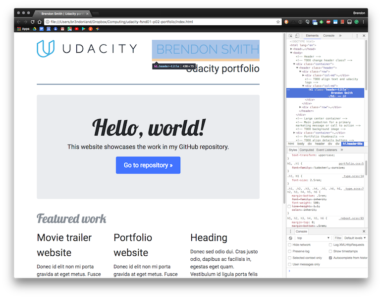
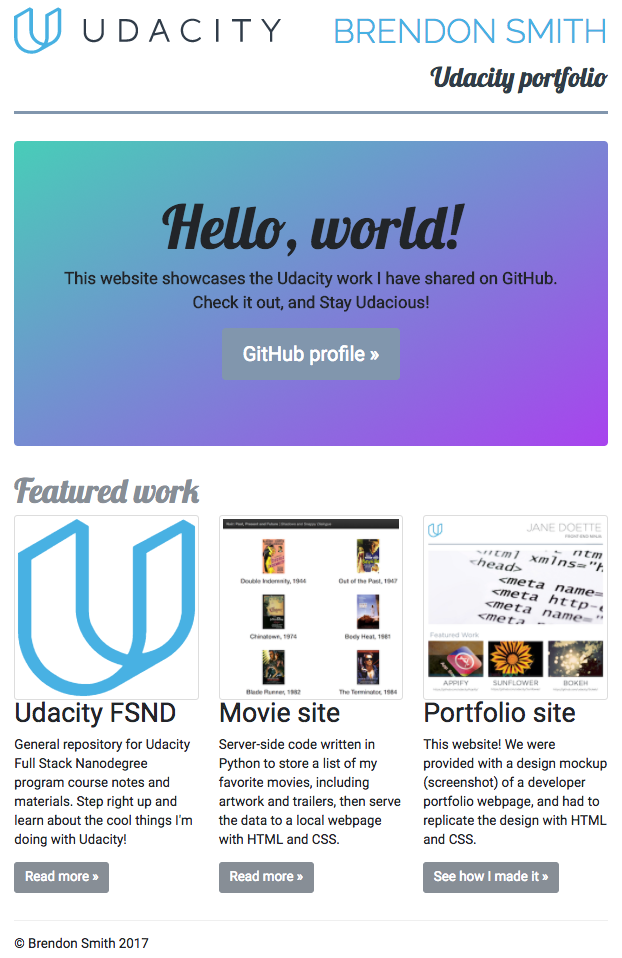
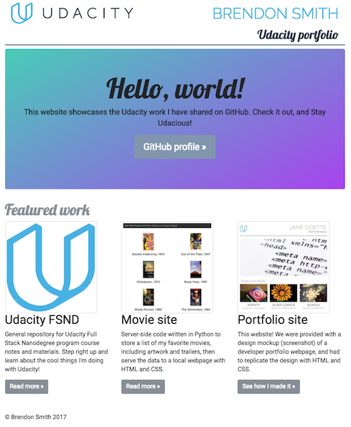
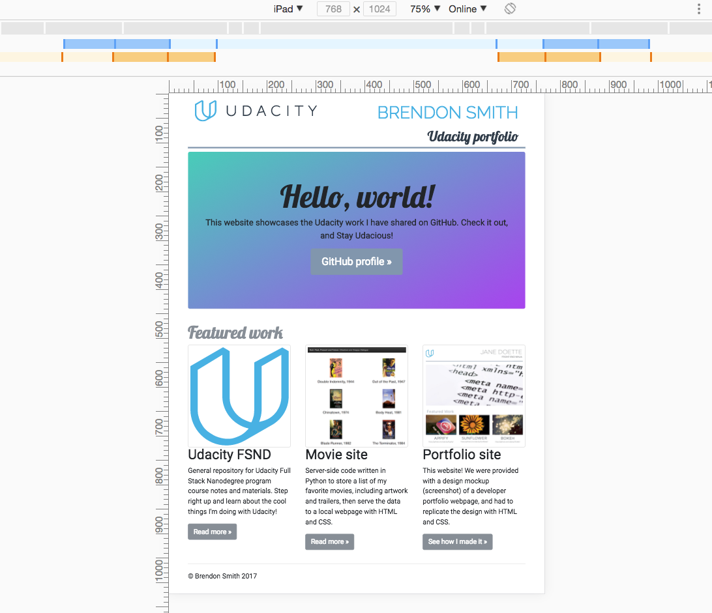
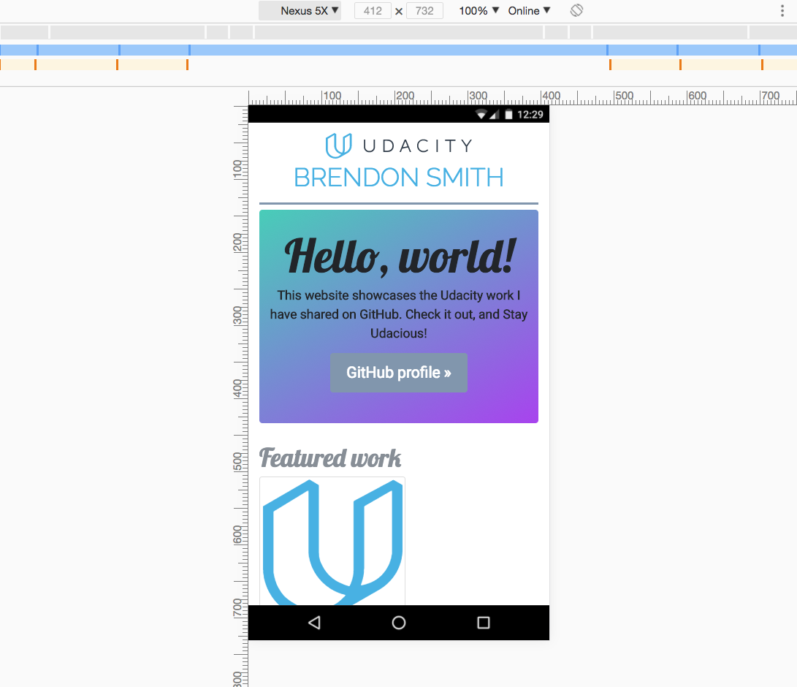
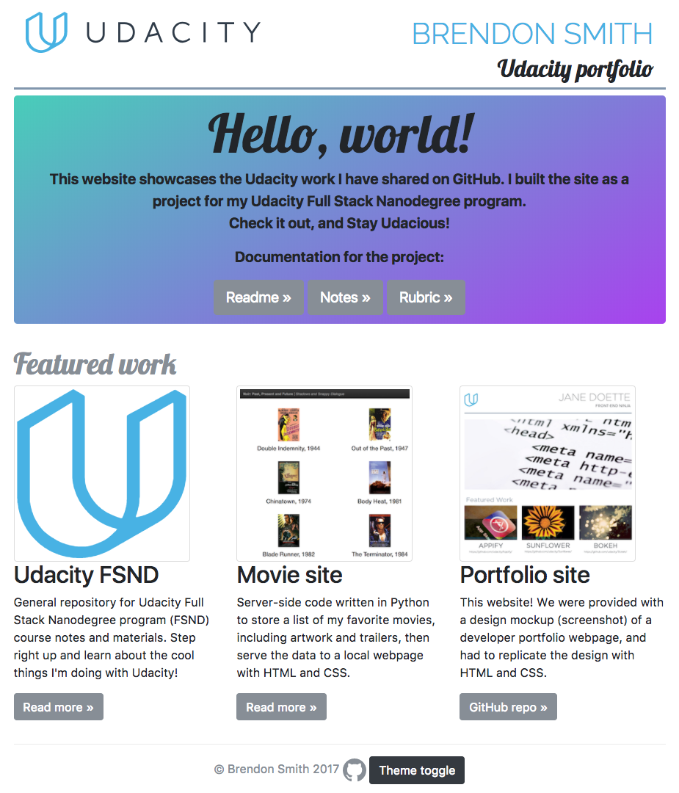
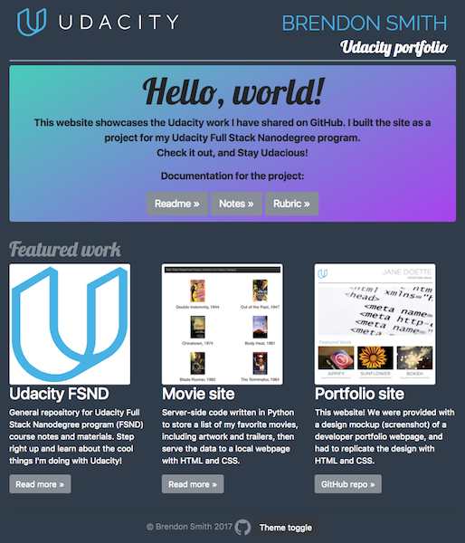

Portfolio website construction notes
====================================

<p align="left">
    <a href="https://www.udacity.com/">
        
    </a>
</p>

**Udacity Full Stack Web Developer Nanodegree program**

Part 01. Programming fundamentals and the web

Project 02. Build a portfolio site

Brendon Smith

br3ndonland

<!-- START doctoc generated TOC please keep comment here to allow auto update -->
<!-- DON'T EDIT THIS SECTION, INSTEAD RE-RUN doctoc TO UPDATE -->
**Table of Contents**  *generated with [DocToc](https://github.com/thlorenz/doctoc)*

- [Summary](#summary)
- [Development environment](#development-environment)
- [Bootstrap](#bootstrap)
- [General webpage style and structure](#general-webpage-style-and-structure)
- [Header](#header)
- [Jumbotron](#jumbotron)
- [Portfolio thumbnails](#portfolio-thumbnails)
- [Footer](#footer)
- [Theme toggle](#theme-toggle)
- [Website creation with Jekyll](#website-creation-with-jekyll)
- [Jekyll website hosting with GitHub Pages](#jekyll-website-hosting-with-github-pages)
- [Website troubleshooting](#website-troubleshooting)

<!-- END doctoc generated TOC please keep comment here to allow auto update -->


# Summary

This was my second project for the Udacity Full Stack Web Developer nanodegree program. It is designed to showcase the Udacity work I have shared on GitHub. We were provided with a design mockup (screenshot) of a developer portfolio webpage, and had to replicate the design with HTML and CSS. 

I based the webpage on [Bootstrap](http://getbootstrap.com/) v4.0.0-beta. In the main webpage *index.html*, I linked to the Bootstrap core CSS through their Content Delivery Network (CDN), and created *portfolio.css* for additional custom styling.

I provided a toggle button in the footer that uses jQuery JavaScript to change the page color scheme.

The repository for this project is available at [https://github.com/br3ndonland/udacity-fsnd01-p02-portfolio](https://github.com/br3ndonland/udacity-fsnd01-p02-portfolio).

I used the webpage design to create a full website with Jekyll, and hosted the site with GitHub Pages at [https://br3ndonland.github.io/udacity-fsnd01-p02-portfolio](https://br3ndonland.github.io/udacity-fsnd01-p02-portfolio). The website has three pages: "Home," an "About" page explaining how I built the site in detail, and a "Rubric" page providing a comparison with the Udacity project rubric and all the Udacity documentation for the project.


# Development environment

I wrote the code in Sublime Text, as usual. I typically had two windows open: a double pane window, with left side for the core files I was creating (like this one, and the HTML and CSS), and right side for the Bootstrap core files for reference, and a separate window for my Udacity reference materials. I usually had three Chrome browser windows open: one for Udacity, one for reference sites like Bootstrap, and a third to preview my site with Developer Tools.


# Bootstrap

I based the site on [Bootstrap](http://getbootstrap.com/) v4.0.0-beta. 


## Bootstrap installation and use options

I explored the different ways to use Bootstrap.

* Content Delivery Network (CDN): servers provide cached versions of the compiled CSS and JS. This is the easiest option, used in the Bootstrap starter HTML template. If you need to customize the CSS, add another file and reference it below the core CSS in the HTML.
* Direct download: it can be helpful to have a local copy, but it is simplest to link to the CDN. Modifying Bootstrap’s core files is not recommended. See [Theming Bootstrap](https://getbootstrap.com/docs/4.0/getting-started/theming/).
* Package manager: package managers are convenient, but note that they may pull in Bootstrap source files, which must then be compiled and minified. I used `yarn` to install, but didn't end up using the package-managed Bootstrap.
  - Installed [`yarn`](https://yarnpkg.com/en/) with [Homebrew](https://brew.sh/): `brew install yarn`
  - Installed Bootstrap with `yarn`: `yarn add bootstrap@4.0.0-beta` and dependencies `jquery` and `popper.js`
  - Bootstrap can then be called using the package manager.
* Bootstrap is compiled and minified before use. 
  - It is written using Sass (Syntactically Awesome Style Sheets), which must be converted to regular CSS before use.
  - the *.min* extension indicates minified. This removes all unnecessary characters from source code.


## Using Bootstrap

* I used the Boostrap CDN option to link out to cached versions of the compiled CSS and JS, as described in the [Bootstrap getting started docs](https://getbootstrap.com/docs/4.0/getting-started/introduction/). 
* I created an additional CSS file called *portfolio.css* to modify and extend the Bootstrap core CSS when necessary. 
* I kept the core Bootstrap CSS open in Sublime Text for reference. It was also helpful to open the [Bootstrap template examples](https://getbootstrap.com/docs/4.0/examples/) in Chrome, then inspect with developer tools.
* I frequently referred to the [Bootstrap docs](https://getbootstrap.com/docs/4.0/getting-started/introduction/) and [Bootstrap GitHub readme](https://github.com/twbs/bootstrap).
* **Bootstrap has a steep learning curve.**
  - The Bootstrap framework has many features, but the documentation lacks detailed explanations of class definitions and web elements. 
  - There are online [Bootstrap editors](https://bootstrapbay.com/blog/bootstrap-editors/) like [Codeply](https://www.codeply.com/) and [Bootply](https://www.bootply.com/) that can make development easier. 
  - There are also templates available (like the [premium themes from Bootstrap](https://themes.getbootstrap.com/)) from [WrapBootstrap](https://wrapbootstrap.com/) and [BootstrapBay](https://bootstrapbay.com/). 
  - **It was helpful to work directly with the Bootstrap code as a learning experience, but it would be slow for professional web development.**


# General webpage style and structure

See the **Rubric comparison** section of README.md for details.

* I first focused on building basic structure with HTML. In parallel, I created CSS styling for each new HTML element I added.
  
* I used some elements from [narrow-jumbotron](https://getbootstrap.com/docs/4.0/examples/narrow-jumbotron/).
* I used [Google Fonts](https://fonts.google.com). Font weights are specified when referencing the CSS.
* I kept code as concise as possible, and used CSS shorthand wherever possible.
* *Responsive design:* Bootstrap is mobile-first, meaning that the website structure is designed for extra small devices (portrait phones, less than 576px), and then scaled up with `min-width` media queries. In this case, I had to design desktop-first. I had to design the site based on a desktop webpage mockup, then adjust it for smaller sizes. See below for design of each section. I added [Bootstrap responsive images](https://getbootstrap.com/docs/4.0/content/images/#responsive-images) to this Markdown file with HTML `img` tags, and the Bootstrap `class="img-fluid"`.
* I generated TOC for all markdown files with [doctoc](https://github.com/thlorenz/doctoc):
  ```bash
  $ npm install -g doctoc
  $ cd .../udacity-fsnd01-p02-portfolio/docs/pages
  $ doctoc . --maxlevel 1 --github
  ```
  In the future, I will look at other TOC creation options in kramdown (the Markdown to HTML converter used by Jekyll, see [below](#website-creation-with-jekyll).


# Header

* *[Container](https://getbootstrap.com/docs/4.0/layout/overview/#containers):* I placed the `header` inside a `container` to keep it in line with other elements, as shown in the portfolio site mockup. A `container` should usually be the top-level div, but not always. For example, in the Bootstrap [docs](https://getbootstrap.com/docs/4.0/content/typography/), `header` is not in a `container`, and is outside the margins of the container below.
* *[Grid](https://getbootstrap.com/docs/4.0/layout/grid/):* I created a grid in the header to show the Udacity logo and the text as two columns in the same row. Bootstrap has most of the optimal [flexbox formatting](https://css-tricks.com/snippets/css/a-guide-to-flexbox/#flexbox-background) built in already. There are 12 columns by default. I also tried including header elements as spans, but they did not align vertically.
* *Udacity logo:* I set `max-width: 400px;` in the CSS to limit size of the SVG file. I also hyperlinked the image to the Udacity website.
* *Responsive text horizontal alignment:* I created a media query to center align the text when the header reduces to one column. Bootstrap provides text alignment classes like `text-right` and `text-uppercase` that I could reference directly in the HTML, but this makes things more complicated, because I would have to coordinate style between CSS and HTML, so I opted to align the text with my own CSS.
* *Header text vertical alignment:* I wanted the "Brendon Smith" text at the right side of the header to be centered with the Udacity logo svg text. 
  - I tried `vertical-align: middle;` and the [Bootstrap vertical alignment](https://getbootstrap.com/docs/4.0/utilities/vertical-align/) class `align-middle` to no avail. 
  - I searched the Bootstrap documentation and found the [text section](https://getbootstrap.com/docs/4.0/utilities/text/#text-alignment), but that didn't fix it either. 
  - I found a [Stack Overflow question](https://stackoverflow.com/questions/20547819/vertical-align-with-bootstrap-3#20548578) that addressed this issue, but the solution didn't work for me.
  - I temporarily squashed the bug by inspecting the text with Chrome Developer Tools, and looking at the inherited properties. I found `line-height: 1.1;` switched it off, and... text centered! 
  
  - Now to change the code. It took a long time to find the solution. Like, days. I eventually realized that, when I turned off `line-height: 1.1;` with Developer Tools, the text was reverting to the previously applied style. After searching through the Bootstrap core CSS with the query "line-height", I eventually found that the default for `body` is 1.5.
  - **I had to set the header text to `line-height: 1.5;`:**
  ```css
  .header-title {
    font-family: 'Raleway', sans-serif;
    color: #02b3e4;
    text-align: right;
    text-transform: uppercase;
    line-height: 1.5;
  }
  ```
* *Navbar:* Later, during [website troubleshooting](#website-troubleshooting), I realized it would be helpful to have navigation at the top of the page. I included a collapsed [Bootstrap navbar](https://getbootstrap.com/docs/4.0/components/navbar/). I added to the CSS media query so that the navbar is centered on small screens.

# Jumbotron

* *Background:* I used the signature Udacity gradient. I also liked the simple gray default, and tried using different background images, such as the ones from the [Google Material Design guidelines](https://material.io/guidelines/material-design/introduction.html).
* *Responsive design:* I noticed that the jumbotron `h1` text had strange breakpoints. At viewport width <534px it was on two lines, then between 534px and 575px one line, then between 576px and 767px it broke onto two lines again, then ≥768 back to one line. I wanted to eliminate the break point between 576px and 767px. I first got rid of the Bootstrap `narrow-jumbotron` CSS that put in a breakpoint at `48em`, then coordinated the media queries with the column sizes set with classes in the HTML. **I finally got it: `col-md-6` header columns on medium displays, `col-sm-4` columns for thumbnails, and two media queries to shrink the page down at `991px` and `768px`.**
* *Buttons:* I chose not to use a button group, so the buttons would stay separated. In order to prevent the buttons from breaking onto multiple lines on mobile, I simply reduced the font size to `font-size: 1.2rem;`.


# Portfolio thumbnails

* *Responsive design:* 
  - `img-thumbnail` Bootstrap class used for responsive portfolio thumbnail images.
  - All images same height: Bootstrap gives the images `max-width: 100%` and `height: auto`, which means they are not the same height. I created alternate thumbnail versions of the images, and cropped and resized them so they were 300px square (the largest they will be is 276px).
  - Smaller images on mobile: added `max-height: 200px;` to the media query mentioned above.
* *Link buttons:* I want to vertically align the three link buttons below the thumbnail descriptions. If I moved the buttons onto a separate row, they would not stay with the rest of the column when the site resizes for small viewports. I haven't fixed this yet, but I will keep it in mind for the future.
* *PDF rendering:* I wanted to use the design mockup as a thumbnail for my portfolio site, but it was a PDF. PDF rendering in browsers requires plugins and may not be consistent. I just converted it to an image.

**Here is a screenshot after completing the Jumbotron and portfolio thumbnails:**



**Here are screenshots after completing the responsive homepage on desktop, iPad, and Nexus:**

*Desktop*




*iPad*




*Nexus*




# Footer

* I kept the footer relatively simple, in terms of formatting. I centered it with CSS and used the `text-muted` class to gray it out.
* The sizing of the GitHub icon was a bit complicated. I set its class to `2rem`. I also wanted to disable the default link behavior, because an underline was popping up behind the GitHub icon. I had to dig around in the Bootstrap documentation a lot, and eventually found the `card-link` class [here](https://getbootstrap.com/docs/4.0/components/card/#titles-text-and-links), which doesn't have underlining.
* I included a button to toggle [color schemes](#color-schemes). See below.


# Theme toggle

## Colors

* I prefer dark themes, like many developers, so **I wanted to provide a dark theme option on my website.** Dark themes are becoming more mainstream. See [DuckDuckGo](https://duckduckgo.com/settings#theme) and [Jekyll](https://jekyllrb.com/) for examples of dark themes. 
* I originally tried to toggle the colors purely with CSS, using the guidelines from [design shack](https://designshack.net/articles/css/lightsoff/). I wasn't able to get it to successfully toggle any changes, at least with a local website preview, and it's a somewhat dirty hack. 
* I'm already loading the jQuery JavaScript library for Bootstrap, so why not build in some jQuery functionality? **I didn't know JavaScript at this point. Time to learn!**
* I started by creating *js/portfolio.js*, and loading it at the end of the HTML:
  ```html
  <script src="js/portfolio.js" type="text/javascript"></script>
  ```
* I added [Bootstrap buttons](https://getbootstrap.com/docs/4.0/components/buttons/) instead of fake CSS "buttons" like the design shack tutorial.
* The jQuery website had some helpful tips in their [documentation](http://learn.jquery.com/about-jquery/how-jquery-works/#adding-and-removing-an-html-class). I used some basic code to make sure jQuery was working:
  - *Test CSS added to `portfolio.css`:*
    ```css
    .jQuery-test {
      font-weight: bold;
      text-transform: uppercase;
    }
    ```
  - *Test jQuery JavaScript added to `portfolio.js`:*
    ```javascript
    // test code

    // make text capitalized and bold
    $( "a" ).addClass( "jQuery-test");

    // make links disappear when clicked
    $( "a" ).click(function( event ) {
        event.preventDefault();
        $( this ).hide( "slow" );
    });
    ```
* All the links were bold and uppercase, and the buttons disappeared when clicked! Success!
* Next, I applied the disappear-on-click action to the dark toggle button, to make sure that this specific button was working. A period is needed at the beginning of the class name to indicate CSS. 
  ```javascript
  $( ".btn-theme-toggle" ).click(function( event ) {
  event.preventDefault();
  $( this ).hide( "slow" );
  });
  ```
* Next, I used `toggleClass` to toggle the dark theme on and off with a single button. I found the `toggleClass` function with a documentation search. Note that a period is required when initially *referencing* the class (after the `$`, before `toggleClass`) because it is referring to CSS, but not when *toggling* the class (after `toggleClass`), because the class name is added to HTML, where periods are not used. Specify multiple classes with spaces between them, just as in HTML. See [w3schools docs](https://www.w3schools.com/jquery/html_toggleclass.asp). I also checked out the [jQuery docs](https://api.jquery.com/toggleClass/), but found them clunky and difficult to read.

  *CSS:*
  ```css
  /* Dark theme */
  .theme-dark {
    background-color: #2d3c49;
    color: #ddd;
  }
  ```
  *jQuery JavaScript:*
  ```javascript
  // Theme toggle
  $( '.btn-theme-toggle' ).click(function() {
      $( 'body' ).toggleClass( 'theme-dark' );
  });
  ```


## SVG toggle

**When the dark theme is toggled, I want the "Udacity" text in the header to invert to white to stand out against the dark theme background.** The Udacity logo is an SVG, and it shouldn't be difficult to work with SVG, because it's just simple code. Right? Wrong.

* I tried manipulating the SVG as an image with CSS. I found the `filter: invert(100%);` CSS property, but I only want to invert the text, not the U. 
* I wanted to manipulate the SVG code with jQuery or CSS, instead of creating two separate files for light and dark versions of the image. This led me down an SVG rabbit hole and I didn't end up toggling the SVG code directly. The lack of jQuery interaction with SVG is a known issue (see GitHub issue [jQuery Class Operations on SVG DOM Attributes #2199](https://github.com/jquery/jquery/issues/2199)). 
* I tried [this code](https://stackoverflow.com/questions/11978995/how-to-change-color-of-svg-image-using-css-jquery-svg-image-replacement?rq=1) to embed the SVG and change the color as if it was inline, but it didn't work right away and I didn't think it would be an effective strategy.
* The [w3schools jQuery HTML / CSS Methods page](https://www.w3schools.com/jquery/jquery_ref_html.asp) was helpful.
* I checked out the [CSS tricks using SVG page](https://css-tricks.com/using-svg/) by Chris Coyier. It was helpful.
  - I could [use the SVG as a background image in a CSS class](https://css-tricks.com/using-svg/#article-header-id-4). I tried this, using the file path as the URL, but it didn't work, so I would have to paste the code inline into my CSS, and possibly [convert it to a URI](https://css-tricks.com/using-svg/#article-header-id-13). Including inline SVG code is definitely an option, but I decided not to so I could keep my code cleaner for Udacity code review.
  - I tried [referencing the SVG as an object instead of an image](https://css-tricks.com/using-svg/#article-header-id-11), but the hyperlink sat below the image instead of right on top of it (remember, I created a link so the image takes the user to the Udacity website).
  - The article had a link to [SVG.js](http://svgjs.com/), which looks like a helpful library. It is a leaner code library than Raphael, and would probably do what I want. For simplicity in this project though, I will not use it.
* The easiest option was just to save two versions of the file and swap out the file path itself when the dark theme button is clicked. I directly edited the Udacity logo SVG code in Sublime Text to convert the text to white, and saved it as a separate file. I then wrote some jQuery:
  ```javascript
  // Set up variables for image replacement
  var oldSrc = 'img/udacity-long.svg';
  var newSrc = 'img/udacity-long-white.svg';
  // Dark theme toggle
  $( '.btn-theme-toggle' ).click(function() {
      $( 'body' ).toggleClass( 'theme-dark' );
      $('img[src="' + oldSrc + '"]').prop('src', newSrc);
  });
  ```
* This successfully replaced the image, but it didn't toggle, it just stayed replaced.`prop` is a newer alternative to `attr`.
* I switched to the `toggle` function, but had to dig into the documentation to figure it. It was difficult and confusing. There was a [previous `toggle` function](http://api.jquery.com/toggle-event/) that was deprecated. The current `toggle` function is an animation function that shows and hides elements by appending `style="display: none;"` to the HTML. Again, I discovered this by watching the code with Chrome developer tools as I clicked the toggle button. I eventually succeeded by including both versions of the Udacity logo SVG in the HTML from the get-go, using the `.header-logo` class from my CSS file as a [*selector*](https://www.w3schools.com/jquery/jquery_selectors.asp) for both, but including `style="display: none;"` in the HTML for the one with white text. This allowed me to toggle between versions of the SVG with one line of jQuery code:

  *HTML:*
  ```html
  <a href="https://udacity.com">
    
    
  </a>
  ```
  *jQuery JavaScript:*
  ```javascript
  // Theme toggle
  $( '.btn-theme-toggle' ).click(function() {
      $( 'body' ).toggleClass( 'theme-dark' );
      $( '.header-logo' ).toggle();
  });
  ```
* I am aware that it is not ideal to include two versions of an image on a website because of size and speed considerations. In the future, I will try something more efficient, like including the SVG code inline in my CSS, and styling it by changing CSS classes. I found some ideas in the [awesome-svg GitHub repo](https://github.com/willianjusten/awesome-svg).


Here are screenshots of the webpage after completing the theme toggle:


*Light*




*Dark*




# Website creation with Jekyll

## Intro 

**I used this project as an opportunity to expand my skills from building single webpages to building multi-page websites. I used Jekyll to build the site and GitHub Pages to host the site.**

[Jekyll GitHub README](https://github.com/jekyll):

> Jekyll is a simple, blog-aware, static site generator perfect for personal, project, or organization sites. Think of it like a file-based CMS, without all the complexity.

There are **two ways to create a GitHub Pages site: create locally with Jekyll, or create on GitHub directly.** I chose to create the site locally, as recommended in [Jonathan McGlone's tutorial](http://jmcglone.com/guides/github-pages/):

> I recommend setting up Jekyll on your own computer so you can edit and preview your site locally, and when ready, push those changes to your GitHub repo...

There are also **two types of GitHub Pages sites: user and project pages.** I made this a project page.

## [Jekyll and Ruby installation](https://jekyllrb.com/docs/installation/)

* [Install Ruby on command line with Homebrew](https://www.ruby-lang.org/en/documentation/installation/#homebrew): `$ brew install ruby`
* [Install RubyGems](https://rubygems.org/pages/download): RubyGems is a Ruby package manager. A gem is a Ruby software package. `$ gem install rubygems-update`, then `update_rubygems`. Can also just use `$ gem update --system`. 
* Verify that GCC and Make are already installed: `gcc -v` `make -v`
* Install Jekyll and bundler: `gem install jekyll bundler`


## [Jekyll website creation](https://jekyllrb.com/docs/quickstart/#options-for-creating-a-new-site-with-jekyll)

* Create Jekyll website in *docs/* folder for GitHub pages project page:
  ```bash
  $ cd <PATH>
  $ mkdir docs
  $ jekyll new docs
  ```
* Locally preview Jekyll website: 
  ```bash
  $ cd <PATH>
  $ bundle exec jekyll serve
  ```
* Jekyll will create a `_site/` directory. Do not directly modify the files in the `_site/` directory. They will update automatically.
* Jekyll automatically creates a *.gitignore* and its directory structure. There is no need to manually build the directory structure as described in the [GitHub Pages guide from Jonathan McGlone](http://jmcglone.com/guides/github-pages/).
* Jekyll websites use [themes](https://jekyllrb.com/docs/themes/) based on Ruby Gems. The files, like *_layouts/* and *_includes/*, are bundled within the gem.


## Jekyll website page includes and layouts

* I had to restructure the webpage code for Jekyll. I found the [creating pages docs from Jekyll](https://jekyllrb.com/docs/pages/) to be lacking. The [convert an HTML site to Jekyll tutorial](https://jekyllrb.com/tutorials/convert-site-to-jekyll/), the [GitHub Pages guide from Jonathan McGlone](http://jmcglone.com/guides/github-pages/) and the [GitHub Pages guide from Anna Debenham at 24 ways](https://24ways.org/2013/get-started-with-github-pages/) were more helpful when adapting the Udacity webpage for Jekyll. I agree with Debenham, who wrote, "Overall, the documentation for Jekyll feels a little sparse and geared more towards blogs than other sites..."
* I [overrode the theme defaults](https://jekyllrb.com/docs/themes/#overriding-theme-defaults) by adding *_layouts/* and *_includes/* folders.
* Instead of including the same header and footer HTML on every page, I added each separately to *header.html* and *footer.html* in my *_includes/* folder.
* I then had to include [liquid templating tags](https://shopify.github.io/liquid/) in each layout to build the webpages.
* Homepage:
  - I created a simple *home.html* layout in *_layouts/*.
  - I included the body of the webpage that I built for the Udacity project in the root directory (the *docs/* folder) as *index.html*, with `layout: home` in the [YAML front matter](https://jekyllrb.com/docs/frontmatter/) instead of the header and footer.
* Other pages: I simply had to include YAML front matter at the beginning of the other pages to format them with layouts.


## Resources

* [Jekyll docs](https://jekyllrb.com/)


# Jekyll website hosting with GitHub Pages

## Intro

Jekyll sites can be deployed to GitHub pages either as user or project pages, as described in the [Jekyll docs](https://jekyllrb.com/docs/github-pages/#deploying-jekyll-to-github-pages). User pages have a dedicated repository and are built from the `master` branch. Project pages are built either from the `docs/` folder on the `master` branch, or on a `gh-pages` branch. I made this repository into a project page from the `docs/` folder.


## Jekyll prep

* Include the [GitHub Pages Gem](https://jekyllrb.com/docs/github-pages/#the-github-pages-gem) in the Gemfile.
* Sitemap: add `jekyll-sitemap` to the `plugins` section of *_config.yml*.
  - [Jekyll tutorial](https://jekyllrb.com/tutorials/convert-site-to-jekyll/#11-add-a-sitemap)
  - [Automatic sitemap generation for GitHub Pages](https://help.github.com/articles/sitemaps-for-github-pages/)


## GitHub

* I included the MIT license from [GitHub's choosealicense.com page](https://github.com/github/choosealicense.com).
* Publish the repository to GitHub. The repository must exist on GitHub before the page can be created.
* Activate GitHub pages for the repository as described [here](https://pages.github.com/):
  - Click on the Settings tab and scroll down to the GitHub Pages section. 
  - Then select the master branch source and click on the Save button.
* GitHub pages will automatically update the site every time you commit to the repository. There is no need to [automate deployment with Git hooks](https://jekyllrb.com/docs/deployment-methods/#automated-methods).


## Resources

* [GitHub Pages docs](https://pages.github.com/)
* [Jekyll GitHub project page docs](https://jekyllrb.com/docs/github-pages/#project-page-url-structure)
* [Jekyll on GitHub](https://github.com/jekyll)
* [GitHub Pages guide from Jonathan McGlone](http://jmcglone.com/guides/github-pages/)
* [GitHub Pages guide from Anna Debenham at 24 ways](https://24ways.org/2013/get-started-with-github-pages/)
* [GitHub Pages guide from Thinkful](https://www.thinkful.com/learn/a-guide-to-using-github-pages/)


# Website troubleshooting

**Liquid, Jekyll, GitHub Pages, and GitHub are not seamlessly integrated.**


## Relative URLs

In my *_config.yml* file, I had to set the `url` and `baseurl` separately:
```yaml
url: "https://br3ndonland.github.io"
baseurl: "/udacity-fsnd01-p02-portfolio"
```

Convert relative links to [Jekyll Liquid filters](https://jekyllrb.com/docs/templates/#filters) for consistent linking throughout the site. The `baseurl` from *_config.yml* will only be prepended to relative urls in the context of Liquid filters.

Liquid templating can be used within HTML. For example, when creating a relative URL to an image, the entire Liquid filter is enclosed within quotes. However, I'm not sure if Liquid templating can be used within YAML front matter.


## Images in Markdown

Images will show up in Markdown files with either HTML `img` tags or Markdown image tags. **Use HTML `img` tags instead of Markdown `` image tags to allow sizing and styling.**

If Jekyll Liquid filters are used to refer to images, even if the filters are within HTML `img` tags, the images will not show up in the Markdown files when viewed on GitHub. **GitHub Pages reads Jekyll Liquid templating, but GitHub.com does not apply Liquid when viewing files in repositories.** You can see this when comparing the [images page of Bootstrap's GitHub Pages site](https://getbootstrap.com/docs/4.0/content/images/) with the [images page in the GitHub repository used to run the site](https://github.com/twbs/bootstrap/blob/v4-dev/docs/4.0/content/images.md).

The solution was to put the pages in a *pages* folder (not *_pages*, apparently custom directories for pages can't begin with [whatever you want](https://jekyllrb.com/docs/pages/#where-additional-pages-live)), set [permalinks](https://jekyllrb.com/docs/permalinks/) in the [YAML front matter](https://jekyllrb.com/docs/frontmatter/), then use a plain HTML relative link starting with `../img/` to point to the directory above. This way, the file path is the same on the website and in the plain GitHub repository.


## Syntax highlighting

GitHub uses Markdown code fences, but Jekyll uses Liquid templating tags. This inconsistency is frustrating.

* The ["Using syntax highlighting on GitHub Pages" page](https://help.github.com/articles/using-syntax-highlighting-on-github-pages/) says, "Syntax highlighting on GitHub Pages works the same way it does on GitHub with GitHub flavored Markdown..." This is not correct. GitHub uses Markdown code fences (triple backticks, "```", with language identifier after the first three backticks), but GitHub Pages uses Jekyll Liquid tags.
*  **GitHub Pages reads Liquid templating via Jekyll, but GitHub.com does not apply Liquid when viewing files in repositories.** I kept the fenced code blocks instead of including the different Liquid templating code snippet formatting for consistency and compatibility with viewing Markdown documents on GitHub. This meant that, when switching to my dark theme, the code stayed as black text and was difficult to see.
  - See [posts](https://jekyllrb.com/docs/posts/#highlighting-code-snippets) and [templates](https://jekyllrb.com/docs/templates/#code-snippet-highlighting) docs.
  - [Using syntax highlighting on GitHub Pages](https://help.github.com/articles/using-syntax-highlighting-on-github-pages/).
  - Also see Jekyll's [Markdown configuration options](https://jekyllrb.com/docs/configuration/#markdown-options).


## Blockquotes

I couldn't get blockquotes to show up, either with Markdown or HTML `blockquote` tags.


## Jekyll themes

There are many Jekyll themes bundled with Jekyll, as you can see when updating with `bundle update`, but there is no index of the themes.
