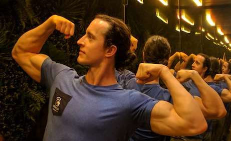
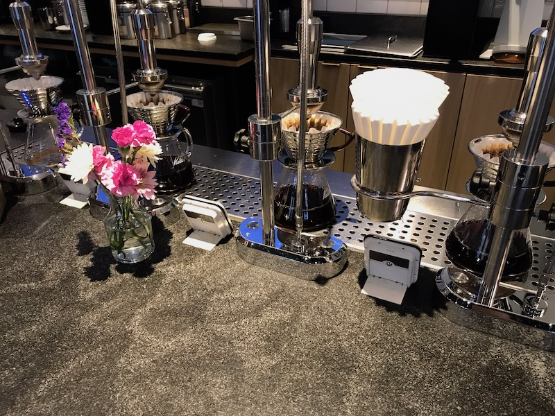
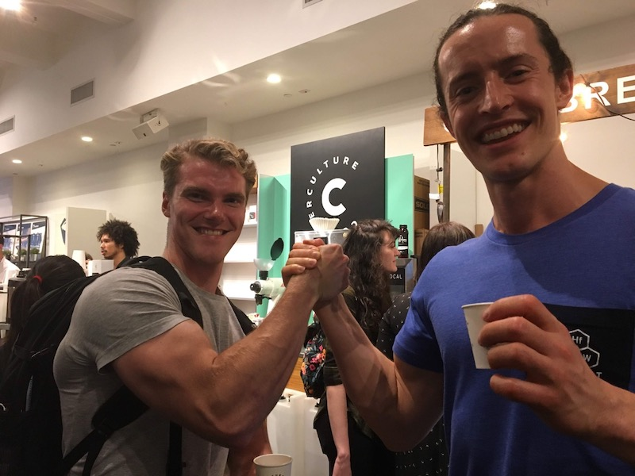
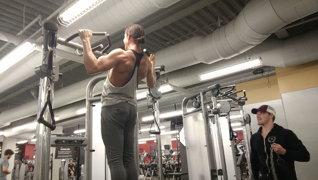
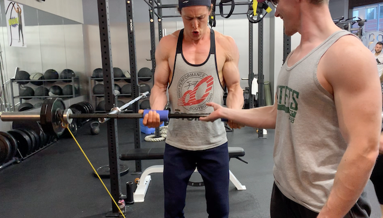
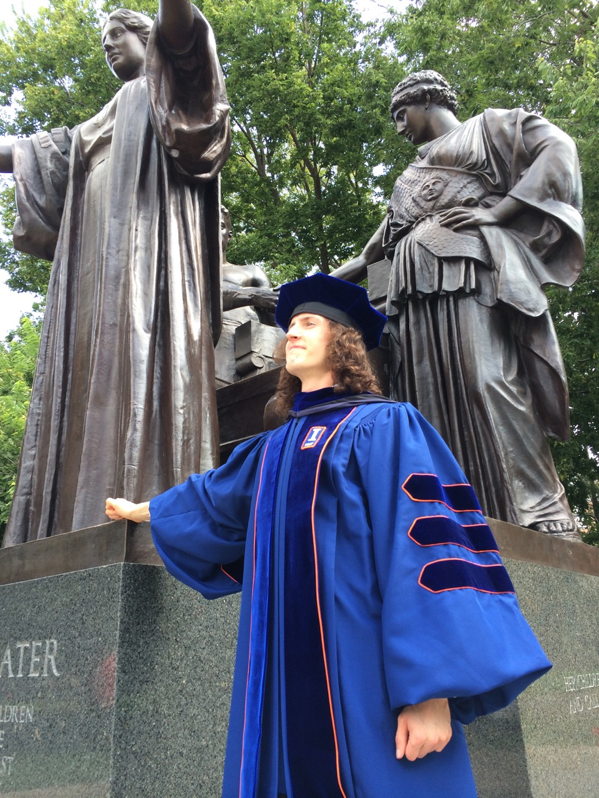
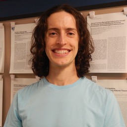
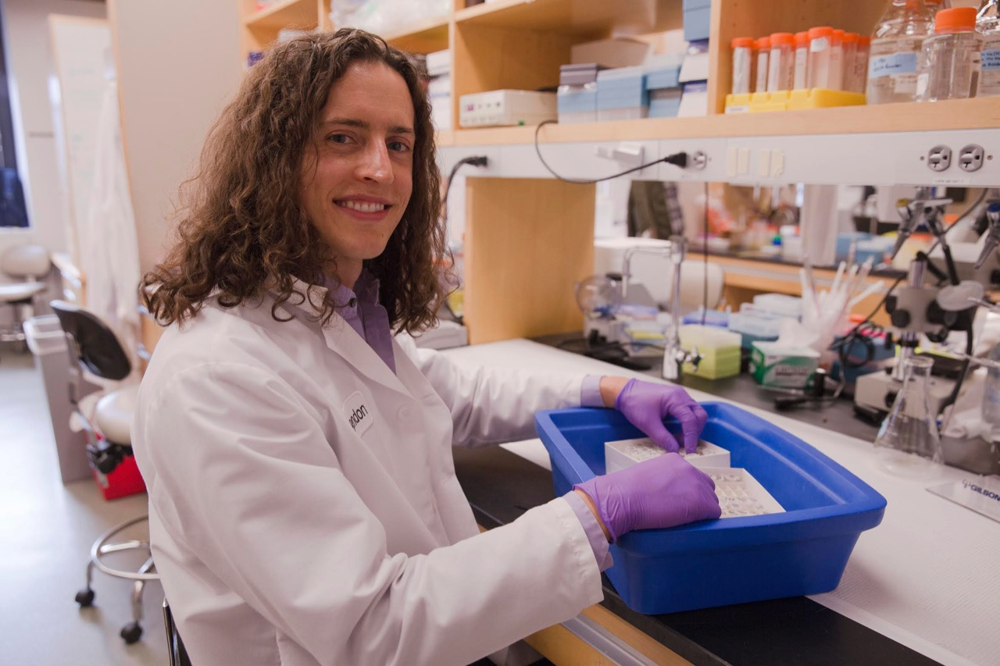

# About me

- [What I do](#what-i-do)
  - [When I'm working](#when-im-working)
  - [When I'm not working](#when-im-not-working)
- [What I did](#what-i-did)
  - [Fitness](#fitness)
  - [Science](#science)
  - [Tech](#tech)

---

## What I do

### When I'm working

**I'm a scientist and full-stack software engineer. I work at Intellia Therapeutics, where I build software for CRISPR-Cas genome engineering, lab automation, and bioinformatics using Vue.js, Python, and AWS.**

**Coding and science motivate me in similar ways: I learn new skills through focused personal growth, and I can use my skills to make a positive impact on the world.**

### When I'm not working

**Specialty coffee**

**Strength training**

[(Back to top)](#top)

---

## What I did

I've gone through three major transitions that shaped who I am today: Fitness, Science, and Tech.

### Fitness

I got into fitness at the beginning of high school. I ran track, and got into swimming and strength training. My fitness pursuits taught me the value of consistency and focus, and helped me develop an active lifestyle that I continue today.

### Science

<h4 class="no-anchor">College</h4>

I got into science during my senior year at Wheaton College, when I started a second major in Applied Health Science. Though I started late, it was a great fit, and I quickly became a thriving member of the department. Mentors helped me figure out who I was as a person, and how to leverage my strengths to create a career. I got practical experience in research, teaching, and administration that made me a competitive applicant for graduate school.

I graduated from Wheaton after five years with two degrees, a greater understanding of my values and identity, and a sense of direction for my career.

<h4 class="no-anchor">Grad school</h4>

I went directly from college into the Nutritional Sciences PhD program at the University of Illinois at Urbana-Champaign. My coursework opened my mind to the wonderful world of cells, molecules, and biochemical reactions, and the effects of food from cell to community. I got rigorous research training, working in both nutritional biochemistry and engineering labs, and leading projects on a large interdisciplinary team.

I began to see the computing challenges involved in scientific research. I wrote VBA macros to automate experimental data analysis, and learned the SAS and R computing languages for statistical programming. I also designed some illustrations for my work, like <a href="https://br3ndonland.keybase.pub/images/science-portfolio/elisa.png" target="_blank">this illustration</a> of an <a href="https://doi.org/10.4137/bmi.s6051" target="_blank">assay method</a> I developed, and <a href="https://br3ndonland.keybase.pub/images/science-portfolio/endothelial-dysfunction.png" target="_blank">this illustration</a> describing a process called endothelial dysfunction I used in a fellowship proposal.

You can download my dissertation for free <a href="https://www.ideals.illinois.edu/handle/2142/72961" target="_blank">here</a>, and you can look up my publications on my <a href="https://orcid.org/0000-0001-6615-8677" target="_blank">ORCID profile</a>.

<h4 class="no-anchor">Postdoc</h4>

<!--  -->

Next, I moved to Boston for postdoctoral research at Harvard. I dived deeper into molecular nutrition during this time. Even a cup of coffee can contain a thousand molecular compounds with potential effects on physiology and health, but few have been studied. I did some work to help illuminate the links between food molecules and physiology. I won a year of grant funding and collaborated with researchers at MIT and in pharma. You can see one of my conference posters <a href="https://br3ndonland.keybase.pub/images/science-portfolio/nutritional-screening-eb2017.png" target="_blank">here</a>.

In the lab, I started to see the importance of documenting my work, and the lack of good apps to do so. Molecular biologists perform complicated experiments with many steps, and each step can affect the outcome. It's difficult to document experiments in enough detail so that other scientists can learn from, and reproduce, our work.

After two years of research, I was promoted to coordinate the operational logistics of the lab as lab manager. I worked with the other lab members to achieve numerous improvements to lab infrastructure and culture. I also encountered a new set of lab management pain points that could be addressed with better tech.

### Tech

After realizing that better technology tools could address many of the most pressing needs in science and nutrition, I decided to build my computational skills. I chose web development because of the broad applicability and open-source nature of web programming.

<h3 class="no-anchor">Learning with Udacity</h3>

I considered various ways to learn, like code bootcamps or computer science grad school. I decided to put together a custom computing curriculum, focused on practical web development training from Udacity and Google. I really enjoyed it. See the <a href="{{ 'udacity' | relative_url }}">Udacity page</a> for more details on my training.

<h3 class="no-anchor">More resources</h3>

Here are some resources, in addition to Udacity and Google, that have helped me learn about computers.

<h4 class="no-anchor">Foundational</h4>

- Courses
  - <a href="https://brilliant.org/courses/computer-science-essentials/" target="_blank">Brilliant computer science essentials</a>
  - <a href="https://cs50.harvard.edu" target="_blank">Harvard cs50</a>
  - <a href="https://cs50.harvard.edu/extension/web/2019/spring/" target="_blank">Harvard cs50 web</a>
- Books
  - <a href="https://www.amazon.com/How-Computers-Work-Evolution-Technology/dp/078974984X" target="_blank">Ron White: How computers work</a>
- Podcasts and blogs
  - <a href="https://medium.com/basecs" target="_blank">basecs</a>
  - <a href="https://changelog.com/" target="_blank">Changelog</a>
  - <a href="https://www.codenewbie.org/" target="_blank">CodeNewbie</a>
  - <a href="https://darknetdiaries.com/" target="_blank">Darknet Diaries</a>
  - <a href="https://syntax.fm" target="_blank">Syntax</a>
  - <a href="https://talkpython.fm/" target="_blank">Talk Python to Me</a> and <a href="https://pythonbytes.fm/" target="_blank">Python Bytes</a>

<h4 class="no-anchor">Historical</h4>

- Books
  - <a href="https://en.wikipedia.org/wiki/The_Idea_Factory" target="_blank">Jon Gertner: The idea factory</a>
  - <a href="https://en.wikipedia.org/wiki/The_Innovators_(book)" target="_blank">Walter Isaacson: The innovators</a>
  - <a href="https://en.wikipedia.org/wiki/Steve_Jobs_(book)" target="_blank">Walter Isaacson: Steve Jobs</a>
  - <a href="https://en.wikipedia.org/wiki/Steven_Johnson_(author)" target="_blank">Steven Johnson: Where good ideas come from</a>
  - <a href="https://en.wikipedia.org/wiki/What_Technology_Wants" target="_blank">Kevin Kelly: What technology wants</a>
  - <a href="https://en.wikipedia.org/wiki/J._C._R._Licklider" target="_blank">M. Mitchell Waldrop: The dream machine</a>

<h4 class="no-anchor">Cultural</h4>

- TV shows
  - <a href="https://www.imdb.com/title/tt2543312/" target="_blank">Halt and Catch Fire</a>
  - <a href="https://www.imdb.com/title/tt2575988/" target="_blank">Silicon Valley</a>
  - <a href="https://www.imdb.com/title/tt4158110/" target="_blank">Mr. Robot</a>

[(Back to top)](#top)
