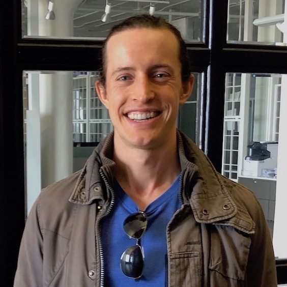
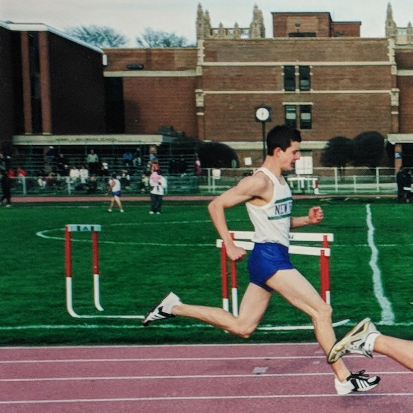
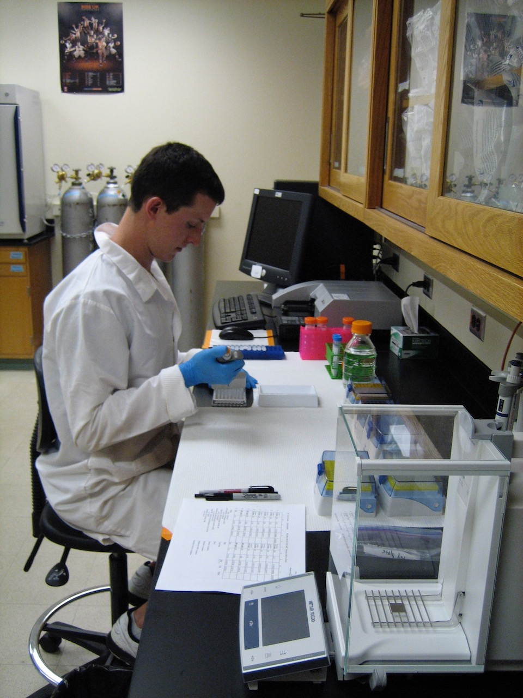
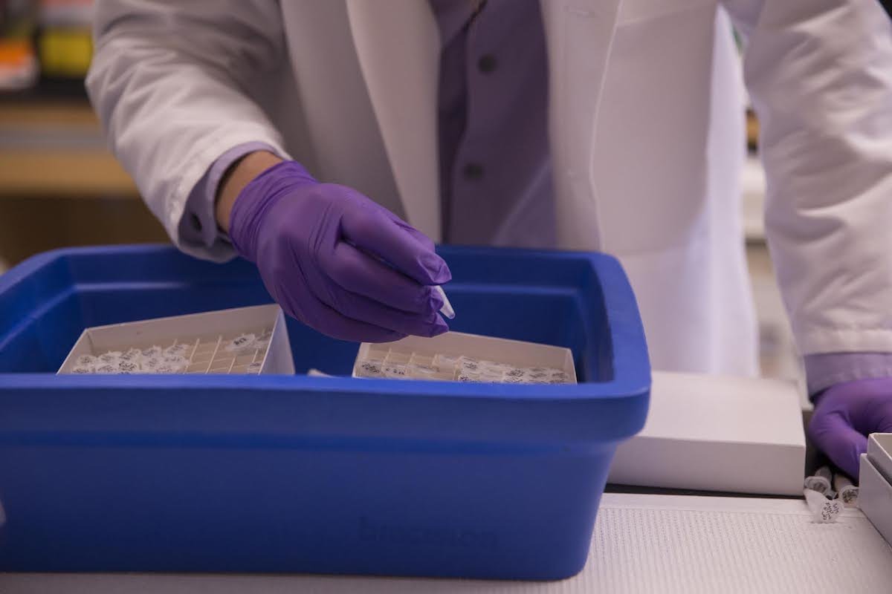
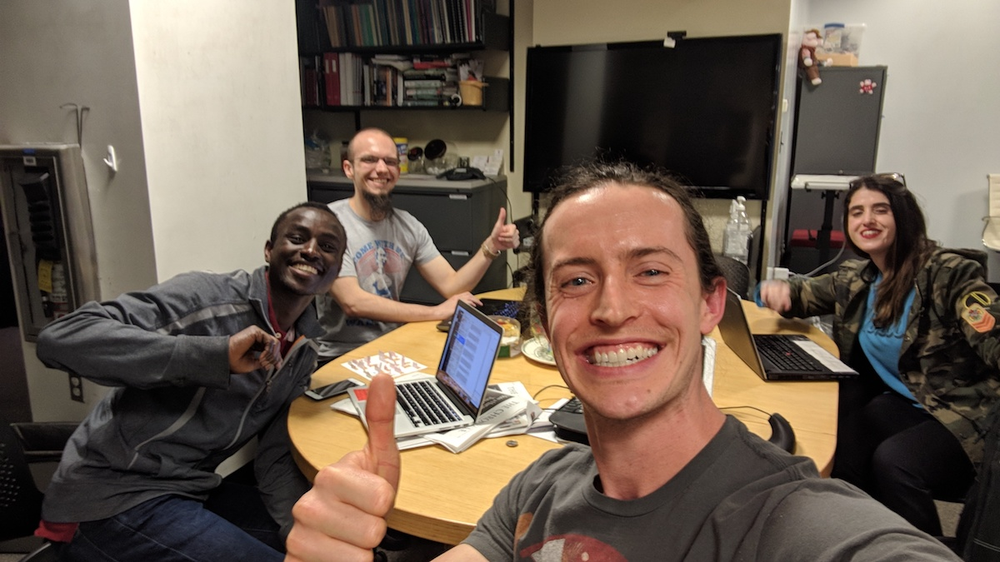

# About me

- [What I do](#what-i-do)
- [What I did](#what-i-did)

---

## What I do

**I'm a full-stack software engineer and scientist. I work at Invicro, a biotech company focused on medical imaging.**

**Coding and science motivate me in the same ways: I learn new skills through focused personal growth, and I can use my skills to make a positive impact on the world.**

**I value:**

- Strong links between **design** and development
- Participation in **open-source** computing
- **Autonomy** and opportunities to take initiative
- **Purposeful structure**, of development practices and of the work environment
- Improvement and **growth**, in my skills and in the company
- **Positive impact** of my work

---

## What I did

I've gone through three major transitions that shaped who I am today: Fitness, Science, and Tech.

<h3 class="no-anchor">Fitness</h3>

I got into fitness at the beginning of high school. I ran track, and got into swimming and strength training. My fitness pursuits taught me the value of consistency and focus, and helped me develop an active lifestyle that I continue today.

<h3 class="no-anchor">Science</h3>

<h4 class="no-anchor">College</h4>

I got into science during my senior year at Wheaton College, when I started a second major in Applied Health Science. Though I started late, it was a great fit, and I quickly became a thriving member of the department. Mentors helped me figure out who I was as a person, and how to leverage my strengths to create a career. I got practical experience in research, teaching, and administration that made me a competitive applicant for graduate school.

I graduated from Wheaton after five years with two degrees, a greater understanding of my values and identity, and a sense of direction for my career.

<h4 class="no-anchor">Grad school</h4>

I went directly from college into the Nutritional Sciences PhD program at the University of Illinois at Urbana-Champaign. My coursework opened my mind to the wonderful world of cells, molecules, and biochemical reactions, and the effects of food from cell to community. I got rigorous research training, working in both nutritional biochemistry and engineering labs, and leading projects on a large interdisciplinary team.

I began to see the computing challenges involved in scientific research. I wrote VBA macros to automate experimental data analysis, and learned the SAS and R computing languages for statistical programming. Our engineering lab had a dedicated server cluster for processing ultrasound imaging data.

<h4 class="no-anchor">Postdoc</h4>

Next, I moved to Boston for postdoctoral research at Harvard. I dived deeper into molecular nutrition during this time. Even a cup of coffee can contain a thousand molecular compounds with potential effects on physiology and health, but few have been studied. I did some work to help illuminate the links between food molecules and physiology. I won a year of grant funding and collaborated with researchers at MIT and in pharma.

In the lab, I started to see the importance of documenting my work, and the lack of good apps to do so. Molecular biologists perform complicated experiments with many steps, and each step can affect the outcome. It's difficult to document experiments in enough detail so that other scientists can learn from, and reproduce, our work.

After two years of research, I was promoted to coordinate the operational logistics of the lab as lab manager. I worked with the other lab members to achieve numerous improvements to lab infrastructure and culture. I also encountered a new set of lab management pain points that could be addressed with better tech.

<h3 class="no-anchor">Tech</h3>

After realizing that better technology tools could address many of the most pressing needs in science and nutrition, I decided to build my computational skills. I chose web development because of the broad applicability and open-source nature of web programming.

I considered various ways to learn, like code bootcamps or computer science grad school. I decided to put together a custom computing curriculum, focused on practical web development training from Udacity and Google. I really enjoyed it. See the [Udacity](./udacity.md) page for more details on my training.

Here are some resources, in addition to Udacity and Google, I have used to learn about computers.

- **Foundational**
  - Courses
    - [Harvard cs50](https://cs50.harvard.edu)
    - [Harvard cs50 web](https://cs50.github.io/web/)
  - Books
    - [How Computers Work, by Ron White](https://www.amazon.com/How-Computers-Work-Evolution-Technology/dp/078974984X)
  - Podcasts and blogs
    - [basecs](https://medium.com/basecs)
    - [Changelog](https://changelog.com/)
    - [CodeNewbie](https://www.codenewbie.org/)
    - [Darknet Diaries](https://darknetdiaries.com/)
    - [Syntax](https://syntax.fm)
    - [Talk Python to Me](https://talkpython.fm/) and [Python Bytes](https://pythonbytes.fm/)
- **Historical**
  - [The Innovators, by Walter Isaacson](http://a.co/66iyBT1)
  - [Steve Jobs, by Walter Isaacson](http://a.co/4aPdCcS)
  - [Where Good Ideas Come From: The Natural History of Innovation, by Steven Johnson](http://a.co/fwkJ8uz)
  - [What Technology Wants, by Kevin Kelly](http://a.co/1zgpMlU)
- **Cultural**
  - [Halt and Catch Fire](http://www.imdb.com/title/tt2543312/)
  - [Silicon Valley](http://www.imdb.com/title/tt2575988/)
  - [Mr. Robot](http://www.imdb.com/title/tt4158110/)

[(Back to top)](#about-me)
