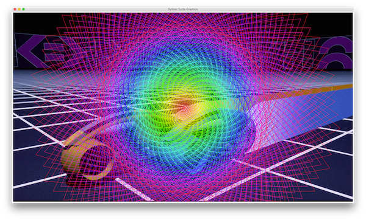
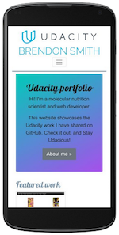
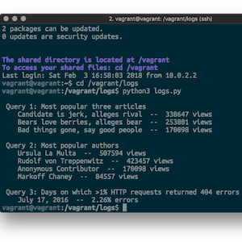
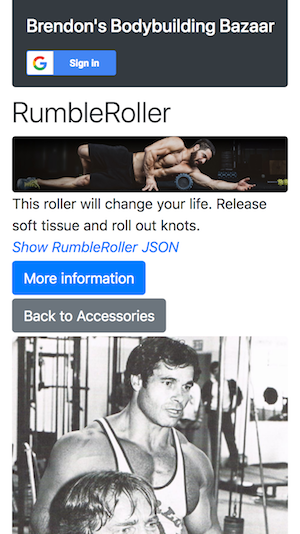
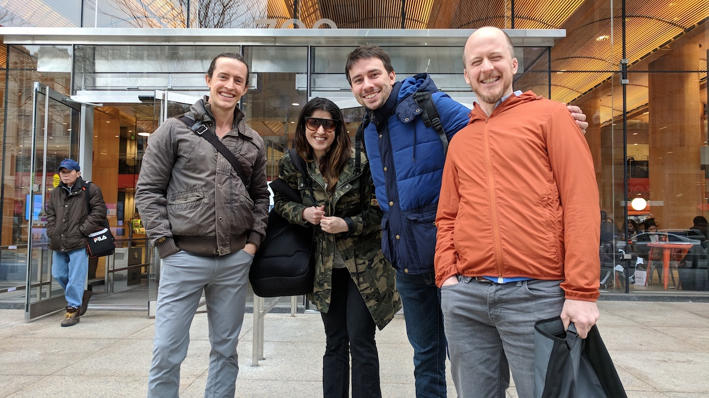
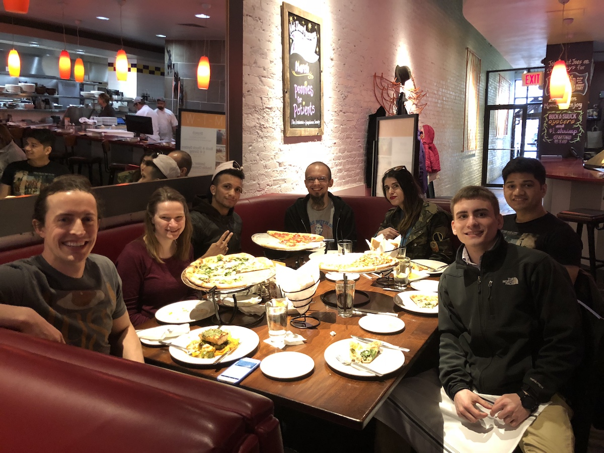
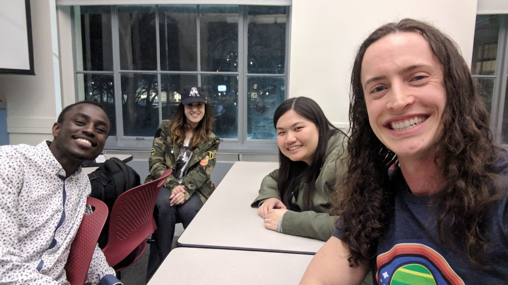
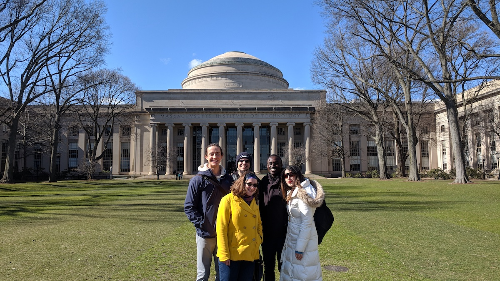
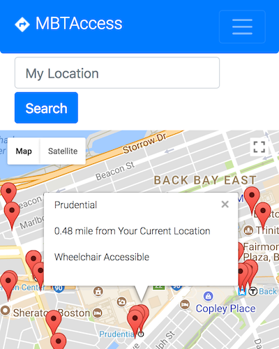
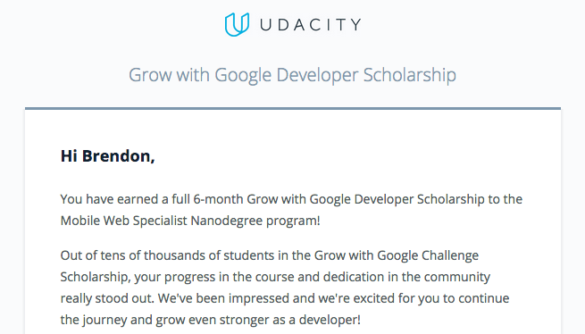

# About me

- [My story](#my-story)
- [Udacity and Google](#udacity-and-google)
  - [Full Stack Web Developer Nanodegree program](#full-stack-web-developer-nanodegree-program)
  - [Grow with Google program](#grow-with-google-program)
  - [Google Mobile Web Specialist Nanodegree program](#google-mobile-web-specialist-nanodegree-program)
- [Other resources](#other-resources)

## My story

---


I got into web development while doing research in a molecular nutrition and metabolism lab. Science is important and valuable, but I began to see that the way we do scientific research now is not effective.

<h3 class="no-anchor">Science faces a reproducibility crisis.</h3>

In science, reproducibility occurs when different scientists do the same experiment and get results that agree. Our current scientific practices do not promote or reward reproducibility. As a result, the scientific community is experiencing a [reproducibility crisis](https://github.com/br3ndonland/R-proteomics-Nrf1#reproducibility). The research published by one lab can't be repeated by other labs, so it's not real progress, and doesn't translate into treatments or cures for humans.

<h3 class="no-anchor">Technology can improve science.</h3>

New technology tools can disrupt scientific incentives and help scientists address the reproducibility crisis. Robotic automation and effective research management apps can improve efficiency and help us do more with our funding dollars. Tools for documenting and sharing our work can improve reproducibility and lead to new knowledge. And all these advances will enable scientists to sustain more balanced, rewarding lifestyles.

I decided to start building my computational skills so I can help create these new technology tools. I considered various ways to learn, like code bootcamps or computer science grad school. I decided to put together my own custom computing curriculum, focused on practical web development training from Udacity and Google. **I am really enjoying it!**

<h3 class="no-anchor">Web development and science motivate me in the same ways.</h3>

I learn new skills through **focused personal growth**, and I can use my new skills to make a **positive impact** on the world.

<!--
<h3 class="no-anchor">The internet and science face similar issues.</h3>

**Centralized control** affects both the internet and science. Power over the internet is concentrated in the hands of a [few companies](https://www.nytimes.com/2016/01/21/technology/techs-frightful-5-will-dominate-digital-life-for-foreseeable-future.html) that do not always [act](https://www.nytimes.com/2018/03/18/us/cambridge-analytica-facebook-privacy-data.html) in the best interest of the people who use their products. Similarly, published scientific knowledge is locked away within the walled gardens of [luxury journals](http://www.theguardian.com/commentisfree/2013/dec/09/how-journals-nature-science-cell-damage-science), when it should belong to the public.
-->

<h3 class="no-anchor">I plan to work as a professional web developer.</h3>

I'm particularly interested in companies that value:

- Purposeful structure, of development practices and of the work environment
- Independence and initiative
- Improvement and growth, in my skills and in the company
- Strong links between design and development
- Participation in open-source computing

My work doesn't necessarily have to focus on science at this point. I will stay involved in the scientific community and eventually link my skills back to science. My dream is to build a decentralized research management and science collaboration platform. A place where researchers could document their experiments, manage and share lab resources, and collaborate effectively, with an interface that is intuitive and seamlessly integrated into their workflows. A place that would foster the development of authentic, reproducible empirical knowledge. A place where science belongs to the people, as it should.

[(Back to top)](#about-me)

## Udacity and Google

---

### Full Stack Web Developer Nanodegree program

- [Lessons](#lessons)
- [Projects](#projects)
- [GitHub repository](https://github.com/br3ndonland/udacity-fsnd)

This was the first training program I did. Here are some highlights from my work in the program:

#### Lessons

Udacity introduces key information and skills in lessons prior to each project.

##### Break timer

[Code on GitHub](https://github.com/br3ndonland/udacity-fsnd/blob/master/01-foundations/python/fsnd01_05_functions.ipynb)

**This was my first milestone as a computer programmer.**

When I began learning Python syntax in the Full Stack Web Developer Nanodegree program, progress was slow, and it was difficult to express myself. It felt very much like the mental exhaustion of practicing a spoken language. The Udacity introductory materials actually recommended that I start with a beginner Nanodegree program first, but I knew that with my motivation and education, I could fill in the gaps in my knowledge and competency. I kept at it and didn't let myself get discouraged.

I got to an exercise in which I had to create a break timer. The timer opens a YouTube video every two hours, to encourage people to take a break while working on the computer. I wrote the code independently, then checked the instructor's solution.

When adding a loop to the break counter, **I came up with a more efficient way to write the program** by using a `for` loop instead of a `while` loop, reducing the required amount of code from eight lines to five. **My code demonstrated that I had learned to think independently and write code in the most efficient and Pythonic way.**

My Python code:

```python
# My break timer
import time
import webbrowser

for i in range(4):
    time.sleep(2 * 60 * 60)
    webbrowser.open_new_tab('https://www.youtube.com/watch?v=IuGO6WHcruU')

```

Instructor's Python code:

```python
# Instructor's break timer
import time
import webbrowser

total_breaks = 4
break_count = 0

while(break_count < total_breaks):
      time.sleep(2 * 60 * 60)
      webbrowser.open_new_tab('https://www.youtube.com/watch?v=IuGO6WHcruU')
      break_count = break_count + 1

```

**I realized the significance of this exercise because I had learned about computing history.** I thought about how Bill Gates and Paul Allen's major accomplishment while at Harvard was writing a BASIC interpreter for the Altair in 3.2 kilobytes of text, leaving memory free to write other programs and launching the personal computing software industry. Walter Isaacson's article on this topic, "[Dawn of a revolution](http://news.harvard.edu/gazette/story/2013/09/dawn-of-a-revolution/)" (*Harvard Gazette* 201309), and the corresponding book, [The Innovators](http://a.co/66iyBT1), were key parts of my computing curriculum.

Computer memory is less limiting today, but we still have to write code efficiently, especially when it is accessed over the web through Content Distribution Networks (CDNs). This is why we use code minification for web distribution.

##### Turtle graphics

[Code on GitHub](https://github.com/br3ndonland/udacity-fsnd/blob/master/01-foundations/python/fsnd01_06_classes_turtles.ipynb)

Instead of just drawing a shape, I imported a gif for the background, and looped through a colorspace to create a psychedelic effect.

Python code:

```python
# Turtle graphics
import turtle
import colorsys


def spiral_into_the_grid():
    """Use turtle graphics to create a colorful spiral."""
    turtle.setup(width=1600, height=900)
    turtle.speed(0)
    turtle.hideturtle()
    window = turtle.Screen()
    window.bgpic('img/TRON.gif')

    for i in range(1250):
        colors = colorsys.hsv_to_rgb(i / 1250, 1.0, 1.0)
        turtle.color(colors)
        turtle.forward(i)
        turtle.left(115)

    turtle.done()


spiral_into_the_grid()

```

Output:



##### Profanity checker

[Code on GitHub](https://github.com/br3ndonland/udacity-fsnd/blob/master/01-foundations/python/fsnd01_08_classes_checker.ipynb)

I wrote a program that analyzes text files, and shows an alert when profanity is detected. I adapted the code for Python 3 and made it as concise as possible. When I realized there was a more effective way to write the program with the `Requests` module, I learned about it and rewrote my code.

Input from movie_quotes.txt:

```text
-- Houston, we have a problem. (Apollo 13)

-- Mama always said, life is like a box of chocolates. You never know what you are going to get. (Forrest Gump)

-- You cant handle the truth. (A Few Good Men)

-- I believe everything and I believe nothing. (A Shit in the Dark)
```

Python code:

```python
# Profanity checker

import requests


def read_text():
    """Read the contents of a text file."""
    quotes = open('movie_quotes.txt')
    contents_of_file = quotes.read()
    print(contents_of_file)
    quotes.close()
    check_profanity(contents_of_file)


def check_profanity(text_to_check):
    """Check the text file for profanity."""
    # Web query
    r = requests.get('http://www.wdylike.appspot.com/?q=' + text_to_check)
    # Output
    if 'true' in r.text:
        print('Profanity Alert!')
    elif 'false' in r.text:
        print('This document has no curse words!')
    else:
        print('Could not scan the document properly.')


read_text()

```

Output:

```text
-- Houston, we have a problem. (Apollo 13)

-- Mama always said, life is like a box of chocolates. You never know what you are going to get. (Forrest Gump)

-- You cant handle the truth. (A Few Good Men)

-- I believe everything and I believe nothing. (A Shit in the Dark)
Profanity Alert!
```

#### Projects

The Full Stack Web Developer Nanodegree program is focused on projects, in which students can independently implement what they have learned in the lessons.

When coding projects, I keep **computational narratives** describing what I do at each step, like journals or lab notebooks. I learned how to keep computational narratives from scientific computing in Jupyter Notebook/JupyterLab and RMarkdown. Computational narratives capture my train of thought, so I can retrace my steps, retain what I have learned, and teach others. Computational narratives for these projects are available in their GitHub repositories.

##### Project 1. Python web server

[Code on GitHub](https://github.com/br3ndonland/udacity-fsnd-p1-python-movie-site)


For my first project, I created a Python web server that serves a movie trailer website. The Python code stores a list of movies, including artwork and trailers, and serves the data to a local webpage with HTML and CSS. I personalized it with a film noir theme, and wrote a mini-review for each movie. I passed code review with only minor corrections.

##### Project 2. Portfolio website

[Code on GitHub](https://github.com/br3ndonland/udacity)



This website began as my second project for the Udacity Full Stack Web Developer nanodegree program. We were provided with a design mockup (screenshot) of a developer portfolio webpage, and had to replicate the design with HTML and CSS. I based the webpage styling on Bootstrap 4. I included extensive customization, including a toggle button that uses jQuery JavaScript to change the page color scheme. I then built the single webpage into a full website with Jekyll, and hosted it on GitHub Pages.

##### Project 3. Database analysis

[Code on GitHub](https://github.com/br3ndonland/udacity-fsnd-p3-sql)



For this project, I wrote a Python program, containing SQL queries, to extract information from a database of news articles with over a million rows. The SQL queries contain advanced joins, selection, and calculation features. The results of the three queries are returned in plain text with Pythonic formatting.

I passed initial code review with no required corrections. The reviewer made some helpful suggestions, and I incorporated them into my code.

##### Project 4. Flask app

[Code on GitHub](https://github.com/br3ndonland/udacity-fsnd-p4-flask-catalog)



I was able to bring together my work on Python, databases, and websites to create a full web application. The app is called "Brendon's Bodybuilding Bazaar" and features a catalog of items useful for bodybuilding, along with an awesome classic picture of Arnold Schwarzenegger and Franco Columbu. I used the Python micro-framework Flask to control the app, and a SQLite database to hold information for the catalog. Users can sign in with Google. After signing in, users can add items and categories to the catalog. The creator of each item or category can also edit or delete it. The app's API (Application Programming Interface) provides catalog data in JSON format. I passed Udacity code review with no required corrections, and the reviewer commended me for my work on the project.

[(Back to top)](#about-me)

### Grow with Google program

---


#### Description

**I won a [scholarship](https://www.udacity.com/grow-with-google) from Udacity and Google.** This is an initiative designed to help people make career changes into coding, and is separate from the Full Stack Web Developer Nanodegree program. I was accepted to the intermediate web developer track to learn techniques for building progressive web apps. There was a three month challenge round, after which the top participants move on to a more advanced Mobile Web Specialist program.

Here's how it went down:

- Found out about the Grow with Google scholarship via Udacity's [Facebook](https://www.facebook.com/Udacity/posts/1250067568431912) and [Medium](https://medium.com/udacity/grow-with-google-50-000-new-scholarships-available-now-1aa0513430b6) posts, while on a bus to NYC for the New York Coffee Festival on October 14, 2017.
- [Applied](https://github.com/br3ndonland/udacity-google/blob/master/udacity-google-00-apply.md) in December 2017.
- Won the scholarship in January 2018.
- Started the challenge course materials on February 21, 2018.
- Completed the challenge course materials on March 7, 2018. The course taught us how to build progressive web apps and use the new features in JavaScript ES6. I tracked my work and made it available on [GitHub](https://github.com/br3ndonland/udacity-google).
- Attended five local meetups.
- Started building a collaborative open-source transportation app, [MBTAccess](https://growwithgooglema.github.io/gwg-mbta/), in April 2018.
- **Ranked in the top 10% of 10,000 students in the intermediate web developer track.** Ranking was based on completing all course materials, as well as participation in the Slack workspace, discussion forum, and meetups.
- **Won a full scholarship to the [Google Mobile Web Specialist Nanodegree program](https://www.udacity.com/course/mobile-web-specialist-nanodegree--nd024).**

#### Meetups

##### Grow with Google meetup at Boston Public Library, February 24, 2018



##### Grow with Google meetup in Watertown, March 24, 2018



##### Grow with Google meetup at MIT, March 24, 2018


##### Grow with Google meetup at MIT, March 29, 2018



##### Grow with Google meetup at MIT, April 7, 2018



#### MBTAccess



- [Web app](https://growwithgooglema.github.io/gwg-mbta/)
- [Source code on GitHub](https://github.com/growwithgooglema/gwg-mbta)

**The [Grow with Google meetups](#meetups) led us to develop an app together.**

We found some common interest in transportation apps. MBTA recently released their [MBTA V3 API](https://api-v3.mbta.com/) that provides public transportation data in JSON API format. One of the under-utilized datasets in their API is the wheelchair accessibility of the stops. Google Maps had [recently started](http://fortune.com/2018/03/15/google-maps-wheelchair-accessible-routes/) providing wheelchair accessibility info, but their implementation is not particularly extensive.

**We aim to create a web app that quickly and conveniently identifies wheelchair accessible stops near the user.** The project has been productive, and has given us great experience managing a team through GitHub.

### Google Mobile Web Specialist Nanodegree program

---

**I won a full scholarship to the Udacity Google Mobile Web Specialist Nanodegree [program](https://www.udacity.com/course/mobile-web-specialist-nanodegree--nd024)** after completing the  Grow with Google challenge course and ranking in the top 10% of 10,000 students. I plan to complete this program on the side, while working as a web developer.



[(Back to top)](#about-me)

## Other resources

---

Here are some other resources I have used to learn about computers.

- **Foundational**
  - [Harvard cs50](https://cs50.harvard.edu)
  - [cs50 web](https://cs50.github.io/web/)
  - [How Computers Work, by Ron White](https://www.amazon.com/How-Computers-Work-Evolution-Technology/dp/078974984X)
  - [basecs](https://medium.com/basecs)
  - [CodeNewbie](https://www.codenewbie.org/)
- **Historical**
  - [The Innovators, by Walter Isaacson](http://a.co/66iyBT1)
  - [Steve Jobs, by Walter Isaacson](http://a.co/4aPdCcS)
  - [Where Good Ideas Come From: The Natural History of Innovation, by Steven Johnson](http://a.co/fwkJ8uz)
  - [What Technology Wants, by Kevin Kelly](http://a.co/1zgpMlU)
- **Cultural**
  - [Halt and Catch Fire](http://www.imdb.com/title/tt2543312/)
  - [Silicon Valley](http://www.imdb.com/title/tt2575988/)
  - [Mr. Robot](http://www.imdb.com/title/tt4158110/)

[(Back to top)](#about-me)